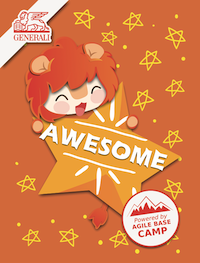
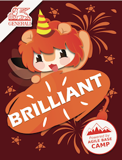
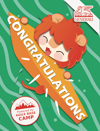
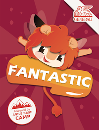
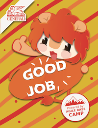
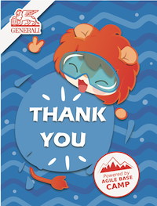
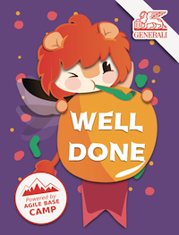
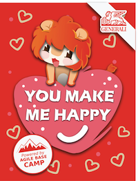

# Agile Base Camp Kudo Cards

Copyright 2019-2020 by Generali Deutschland AG

Design by [@jinye_jia](https://www.instagram.com/jinye_jia)

## Purpose  
These postcards were created as part of the Generali "Agile Base Camp" (ABC) program. The cards are an easy way to say thanks and appreciation to the participants of the agile teams.  

## Cards  

Instructions: Click covers to preview files. Click links below covers to download directly.  

|  |  |  |  |
|:-------------------------:|:-------------------------:|:-------------------------:|:-------------------------:|
| [awesome.pdf](https://github.com/generaliinformatik/abc_kudo_cards/raw/master/docs/awesome.pdf) | [brilliant.pdf](https://github.com/generaliinformatik/abc_kudo_cards/raw/master/docs/brilliant.pdf) | [congratulations.pdf](https://github.com/generaliinformatik/abc_kudo_cards/raw/master/docs/congratulations.pdf) | [fantastic.pdf](https://github.com/generaliinformatik/abc_kudo_cards/raw/master/docs/fasntastic.pdf) |
|  |  |  |  |
| [goodjob.pdf](https://github.com/generaliinformatik/abc_kudo_cards/raw/master/docs/goodjob.pdf) | [thank_you.pdf](https://github.com/generaliinformatik/abc_kudo_cards/raw/master/docs/thank_you.pdf) | [welldone.pdf](https://github.com/generaliinformatik/abc_kudo_cards/raw/master/docs/welldone.pdf) | [you_make_me_happy.pdf](https://github.com/generaliinformatik/abc_kudo_cards/raw/master/docs/you_make_me_happy.pdf) |

## License  

CC BY-NC-ND 4.0 by 2020 Generali Deutschland AG
